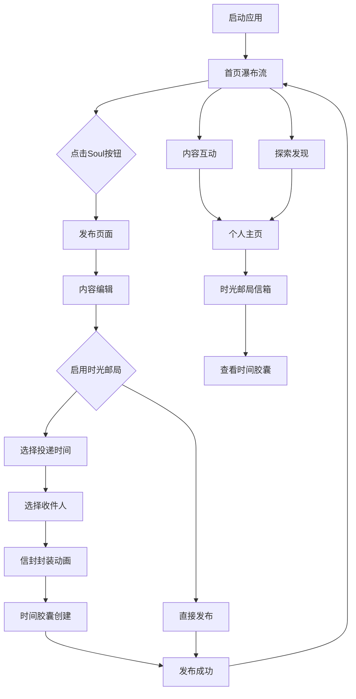

## 1. 产品概述

这是一个融合宫崎骏动画浪漫美学与赛博朋克未来感的社交应用，为追求独特视觉体验和深度情感表达的用户群体打造。产品通过精致的UI设计和创新的交互方式，让用户在梦幻般的界面中分享生活瞬间、表达内心情感，建立有温度的社交连接。

目标用户群体为18-35岁的年轻用户，特别是注重审美体验、喜欢动漫文化和寻求情感共鸣的女性用户。产品定位为高品质视觉社交应用，主打"治愈系社交"概念。

## 2. 核心功能

### 2.1 用户角色

| 角色 | 注册方式 | 核心权限 |
|------|----------|----------|
| 普通用户 | 手机号/邮箱注册 | 发布内容、浏览互动、个人资料管理、时光邮局功能 |
| 认证用户 | 邀请码/活跃度升级 | 优先推荐、特殊标识、高级滤镜使用权、时光邮局高级功能 |
| 管理员 | 后台分配 | 内容审核、用户管理、系统维护 |

### 2.2 功能模块

应用包含以下核心页面：

1. **首页（瀑布流）**: 内容展示、动态背景、互动热区
2. **发布页（Soul发布）**: 文字输入、语音录制、可见性设置、时光邮局设置
3. **个人主页**: 个人信息、发布历史、收藏内容、时光邮局信箱
4. **探索页**: 内容发现、话题标签、用户推荐
5. **消息页**: 私信聊天、系统通知、互动提醒、时光邮局投递
6. **时光邮局**: 时间胶囊管理、未来信件查看、投递状态追踪

### 2.3 页面详情

| 页面名称 | 模块名称 | 功能描述 |
|----------|----------|----------|
| 首页 | 瀑布流展示 | 展示用户发布的内容卡片，支持下拉刷新、上拉加载更多，卡片包含动态背景、内容预览、互动按钮 |
| 首页 | 内容卡片 | 显示用户头像、昵称、发布时间、文字内容（最多500字）、语音播放按钮、点赞/评论/分享功能 |
| 首页 | 动态背景 | 根据内容情感自动匹配宫崎骏风格背景动画，如飘落的樱花、飞舞的萤火虫、流动的云朵等 |
| 发布页 | Soul按钮 | 底部导航栏中央醒目位置，点击触发发布流程，按钮有呼吸灯效果和粒子动画 |
| 发布页 | 文字输入 | 支持最多500字文本输入，提供宫崎骏主题贴纸和表情，实时字数统计 |
| 发布页 | 语音录制 | 支持最长60秒语音录制，录音时有声波可视化效果，可回放和重新录制 |
| 发布页 | 可见性设置 | 设置内容可见范围（公开/仅好友/私密），选择话题标签，设置内容标签 |
| 发布页 | 时光邮局 | 选择投递时间（立即/1小时后/1天后/1周后/1个月后/1年后/自定义），选择收件人（公开发布/私密给自己/指定好友），设置时间胶囊特效 |
| 个人主页 | 个人信息 | 显示头像、昵称、个性签名、关注/粉丝数量，支持编辑个人资料 |
| 个人主页 | 内容管理 | 展示用户发布的历史内容，支持删除和编辑，按时间倒序排列 |
| 个人主页 | 收藏夹 | 展示用户收藏的其他用户内容，支持分类管理 |
| 个人主页 | 时光邮局信箱 | 显示收到的时光信件、已发送的时间胶囊、未来的预约投递 |
| 探索页 | 内容发现 | 基于兴趣和社交关系的个性化推荐，支持按话题和标签筛选 |
| 消息页 | 私信系统 | 支持文字、语音、表情消息，消息气泡采用宫崎骏风格设计 |
| 消息页 | 互动通知 | 显示点赞、评论、关注等互动提醒，支持一键跳转查看 |
| 消息页 | 时光邮局投递 | 显示时间胶囊投递通知，包含开启动画和音效提醒 |
| 时光邮局 | 时间胶囊列表 | 展示所有创建的时间胶囊，按投递状态分类（待投递/已投递/已收到） |
| 时光邮局 | 未来信件预览 | 显示即将在未来收到的信件，带有倒计时效果 |
| 时光邮局 | 投递状态追踪 | 实时显示时间胶囊的投递进度，包含浪漫的星空轨迹动画 |

## 3. 核心流程

### 用户发布流程
用户打开应用 → 浏览首页内容 → 点击底部Soul按钮 → 选择发布类型（文字/语音）→ 输入内容 → 设置可见性 → 选择时光邮局投递时间 → 选择收件人 → 确认信封封装动画 → 发布成功 → 返回首页

### 内容互动流程
用户浏览瀑布流 → 点击内容卡片 → 查看详情（魔法书翻页动效）→ 播放语音（同步显示动态插画）→ 点赞/评论/分享 → 长按触发Soul拾取动效

### 社交发现流程
进入探索页 → 浏览推荐内容 → 点击感兴趣的用户 → 查看个人主页 → 关注用户 → 发送私信

### 时光邮局流程
创建时间胶囊 → 选择投递时间 → 选择收件人 → 信封封装仪式 → 星空投递动画 → 倒计时等待 → 投递时间到达 → 收件人收到通知 → 开启时间胶囊 → 重温美好回忆

## 4. 用户界面设计

### 4.1 设计风格

**色彩方案：**
- 主色调：柔和蓝绿色（#7DD3C0）和粉紫色（#C084FC）
- 辅助色：温暖橙色（#FB923C）和清新薄荷绿（#6EE7B7）
- 时光邮局专色：星空蓝（#1E3A8A）和时光金（#F59E0B）
- 中性色：米白色（#FEF7ED）和深灰色（#374151）

**视觉元素：**
- 按钮样式：圆润3D效果，带有柔和阴影和渐变
- 字体：采用思源黑体，标题18-24px，正文14-16px
- 布局风格：卡片式布局，圆角设计，留白充足
- 图标风格：手绘风格，线条柔和，色彩温暖
- 时光邮局元素：信封、邮戳、星空、时钟、沙漏等浪漫图标

**动画效果：**
- 页面切换：淡入淡出配合粒子效果
- 按钮交互：水波纹扩散效果
- 内容加载：樱花飘落加载动画
- 成功反馈：萤火虫飞舞庆祝动画
- 时光邮局特效：信封封装动画、星空投递轨迹、时间沙漏流逝、时钟指针转动

### 4.2 页面设计概述

| 页面名称 | 模块名称 | UI元素 |
|----------|----------|--------|
| 首页 | 导航栏 | 顶部固定导航，包含Logo（手写风格）、搜索框（圆角设计）、消息图标（铃铛造型）、时光邮局入口（信封图标） |
| 首页 | 瀑布流 | 两列卡片布局，卡片圆角20px，间距12px，背景采用渐变色彩，时间胶囊卡片有特殊边框光效 |
| 发布页 | Soul按钮 | 中央圆形按钮，直径80px，渐变背景，呼吸灯效果，周围有粒子环绕，长按触发时光邮局模式 |
| 发布页 | 输入区域 | 圆角输入框，背景半透明，边框发光效果，支持富文本编辑，时光邮局模式下显示时间选择器和收件人选择器 |
| 发布页 | 时光邮局设置 | 时间选择轮盘（立即、1小时、1天、1周、1月、1年、自定义），收件人选择面板，信封样式预览 |
| 个人主页 | 头部区域 | 圆形头像（120px），昵称采用手写字体，背景为动态插画，新增时光邮局统计（已发送/已收到） |
| 个人主页 | 时光邮局信箱 | 信封造型入口，显示未读时间胶囊数量，点击展开时间轴视图 |
| 消息页 | 聊天气泡 | 用户消息为蓝绿色渐变，对方消息为粉紫色渐变，时间胶囊消息为星空金渐变，圆角15px |
| 消息页 | 时光邮局通知 | 特殊信封造型通知，包含投递时间倒计时，点击展开星空开启动画 |
| 时光邮局 | 时间轴 | 垂直时间轴展示所有时间胶囊，每个节点有邮戳图标，背景为流动的星空 |
| 时光邮局 | 信封详情 | 3D信封展开效果，邮戳掉落动画，内容以信纸形式展现，边缘有樱花装饰 |

### 4.3 响应式设计

- **移动端优先**：针对5.5-6.7英寸手机屏幕优化
- **平板适配**：横屏模式下采用三列瀑布流布局，时光邮局采用双面板设计
- **触摸优化**：所有交互元素最小44px触摸区域
- **手势支持**：左滑返回、右滑切换标签、下拉刷新、长按触发时光邮局模式

## 5. 特色交互设计

### 5.1 魔法书翻页动效
- 触发方式：点击内容卡片
- 动画时长：800ms
- 效果描述：卡片像魔法书一样从右向左翻页，背面显示完整内容，伴有粒子光效

### 5.2 语音动态插画
- 触发条件：播放语音内容时
- 插画类型：根据语音情感分析显示不同场景
  - 开心：樱花树下奔跑的小人
  - 忧伤：雨天撑伞的孤独身影
  - 兴奋：夜空中绽放的烟花
- 同步效果：插画元素随语音节奏变化

### 5.3 Soul拾取动效
- 触发方式：长按内容卡片3秒
- 视觉效果：卡片化作光粒子被吸入底部Soul按钮
- 反馈音效：清脆的"叮"声
- 收藏提示：显示"已拾取到灵魂收藏夹"提示

### 5.4 时光邮局特色动效

**信封封装仪式：**
- 触发时机：确认发布时光胶囊时
- 动画时长：1500ms
- 效果描述：内容化作光粒子飞入信封，信封自动折叠封口，邮戳盖印落下，伴有温暖光效

**星空投递动画：**
- 触发时机：时间胶囊开始投递时
- 视觉效果：信封化作流星划过星空，留下金色轨迹，最终消失在时间隧道中
- 音效配合：空灵的宇宙音效

**时间沙漏流逝：**
- 显示位置：时光邮局时间轴页面
- 动画效果：沙漏持续流动，代表时间在流逝，背景星空缓慢旋转
- 交互反馈：点击沙漏显示距离下个时间胶囊的倒计时

**信纸展开动效：**
- 触发方式：打开收到的时光胶囊时
- 动画描述：信封3D旋转展开，信纸缓缓升起，文字逐行浮现，伴有樱花飘落
- 特殊效果：如果是一年前的内容，会有"时光回忆"的柔光滤镜

## 6. 技术要求

### 6.1 性能标准
- 应用启动时间：≤ 3秒
- 页面加载时间：≤ 1秒
- 图片加载时间：≤ 500ms
- 语音播放延迟：≤ 200ms
- 动画帧率：≥ 60fps
- 时光胶囊投递准时率：≥ 99.9%

### 6.2 兼容性要求
- iOS 12.0+
- Android 8.0+
- 主流浏览器（Chrome, Safari, Firefox）
- 支持WebP图片格式
- 支持H.264视频编码

### 6.3 质量标准
- 崩溃率：≤ 0.1%
- ANR率：≤ 0.05%
- 内存占用：≤ 200MB
- 安装包大小：≤ 100MB
- 用户满意度：≥ 4.5分
- 时光胶囊数据保存可靠性：100%

## 7. 测试场景

### 7.1 功能测试
- 发布内容测试：文字、语音、混合内容发布
- 互动功能测试：点赞、评论、分享、收藏
- 社交功能测试：关注、私信、推荐算法
- 设置功能测试：隐私设置、通知设置、账号管理
- 时光邮局测试：时间选择、收件人指定、信封封装、投递追踪、准时送达

### 7.2 性能测试
- 高并发测试：1000+用户同时在线
- 弱网测试：2G/3G网络环境下的使用体验
- 大数据量测试：加载1000+内容卡片
- 长时间使用测试：连续使用4小时稳定性
- 时光胶囊压力测试：同时创建10000个时间胶囊

### 7.3 用户体验测试
- 新手引导测试：首次使用流程完整性
- 交互流畅度测试：动画效果自然度
- 视觉舒适度测试：长时间使用眼部疲劳度
- 情感共鸣测试：内容表达准确性
- 时光邮局浪漫度测试：用户情感反馈和使用满意度