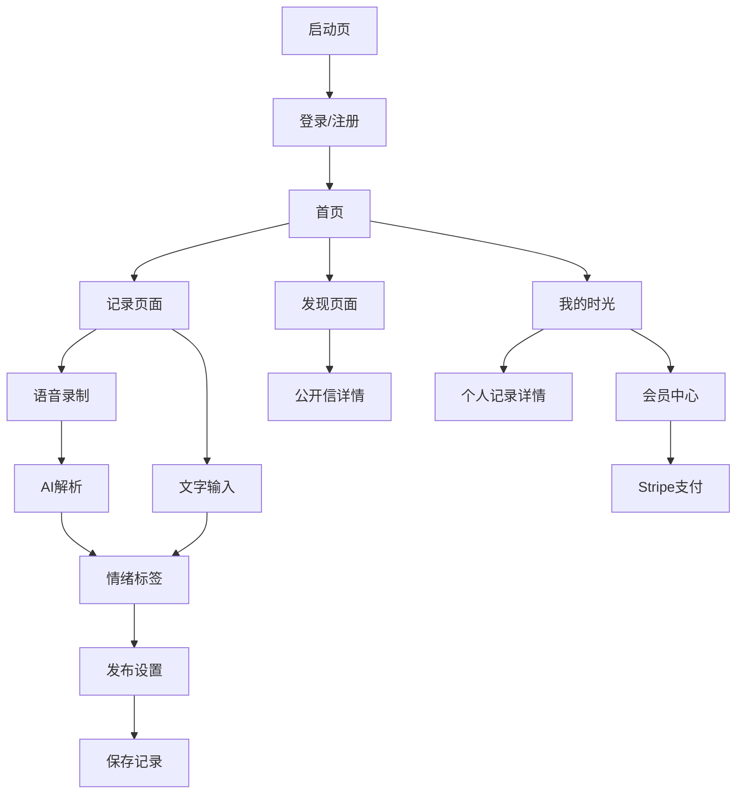

## 1. 产品概述
时光邮局是一款情感记录与分享的Android应用，用户可以通过文字或语音记录自己的情绪和回忆。应用采用宫崎骏风格的温馨设计，结合AI技术解析用户情感，为用户提供私密或公开的情感表达空间。

目标用户群体：希望记录生活情感、分享回忆的各年龄段用户，特别注重情感表达和内心交流的人群。

## 2. 核心功能

### 2.1 用户角色
| 角色 | 注册方式 | 核心权限 |
|------|----------|----------|
| 普通用户 | 邮箱/手机号注册 | 基础文字记录、查看公开内容 |
| 会员用户 | Stripe购买升级 | 语音输入、AI情感解析、私密内容 |
| 访客用户 | 无需注册 | 仅浏览公开内容 |

### 2.2 功能模块
时光邮局包含以下核心页面：
1. **首页**：时光轴展示、快速记录入口、导航菜单
2. **记录页面**：文字输入、语音录制、情绪标签选择
3. **我的时光**：个人记录列表、情感统计、搜索筛选
4. **发现页面**：公开信浏览、热门回忆、情感共鸣
5. **会员中心**：订阅管理、功能介绍、支付入口
6. **个人中心**：用户信息、设置选项、隐私管理

### 2.3 页面详情
| 页面名称 | 模块名称 | 功能描述 |
|-----------|-------------|-------------|
| 首页 | 时光轴 | 展示用户记录的时间线，支持滑动浏览历史记录 |
| 首页 | 快速记录 | 浮动按钮，一键进入记录页面 |
| 首页 | 导航栏 | 底部导航，包含首页、发现、记录、我的四个入口 |
| 记录页面 | 文字输入 | 支持多行文本输入，自动保存草稿 |
| 记录页面 | 语音录制 | 长按录音按钮，实时显示录音时长和波形 |
| 记录页面 | 情绪选择 | 提供多种情绪标签（开心、感动、思念、感慨等） |
| 记录页面 | AI解析 | 自动分析语音内容，提取关键词和情感倾向 |
| 记录页面 | 发布设置 | 选择公开/私密，添加时间标签 |
| 我的时光 | 记录列表 | 按时间倒序展示个人所有记录 |
| 我的时光 | 情感统计 | 图表展示情绪分布和记录频率 |
| 我的时光 | 搜索筛选 | 按时间、情绪、关键词筛选记录 |
| 发现页面 | 公开信墙 | 展示其他用户选择公开的情感记录 |
| 发现页面 | 热门回忆 | 基于点赞和评论的热门内容推荐 |
| 发现页面 | 情感共鸣 | 相似情感的内容推荐 |
| 会员中心 | 订阅状态 | 显示当前会员状态和到期时间 |
| 会员中心 | 功能介绍 | 会员专属功能展示和对比 |
| 会员中心 | 支付入口 | Stripe支付界面，支持月度/年度订阅 |
| 个人中心 | 用户信息 | 头像、昵称、个人简介编辑 |
| 个人中心 | 隐私设置 | 数据导出、账号注销、隐私权限管理 |

## 3. 核心流程

### 用户记录流程
1. 用户点击快速记录按钮进入记录页面
2. 选择文字输入或语音录制方式
3. 如选择语音，系统自动录音并实时显示波形
4. 录音完成后，Gemini 2.5 Pro模型解析语音内容
5. 用户选择情绪标签和发布设置
6. 内容保存到Supabase数据库

### 会员升级流程
1. 用户点击会员功能时提示升级
2. 进入会员中心查看功能对比
3. 选择订阅方案（月度/年度）
4. 跳转Stripe支付界面完成支付
5. 系统自动激活会员权限

## 4. 用户界面设计

### 4.1 设计风格
- **主色调**：温暖的琥珀色(#D4A574)和柔和的米白色(#F5F2E8)
- **辅助色**：天空蓝(#87CEEB)、草原绿(#90EE90)、夕阳橙(#FFB366)
- **按钮样式**：圆角矩形，带有轻微阴影和渐变效果
- **字体**：手写风格的中文字体，标题使用毛笔字体
- **布局风格**：卡片式布局，留白充足，营造宁静感
- **图标风格**：手绘风格，使用自然元素（树叶、云朵、星星等）
- **动画效果**：页面切换采用淡入淡出，按钮有轻微弹性反馈

### 4.2 页面设计概述
| 页面名称 | 模块名称 | UI元素 |
|-----------|-------------|-------------|
| 首页 | 时光轴 | 垂直时间线设计，每个记录点用小树图标标记，背景为淡米色渐变 |
| 首页 | 快速记录 | 圆形浮动按钮，中心为羽毛笔图标，点击后有涟漪效果 |
| 记录页面 | 文字输入区 | 仿信纸纹理背景，边框为虚线设计，字体为手写风格 |
| 记录页面 | 语音录制 | 圆形录音按钮，录音时显示声波动画，背景变为温暖橙色 |
| 记录页面 | 情绪选择 | 圆形情绪图标排布，选中时有缩放动画和颜色变化 |
| 我的时光 | 记录卡片 | 半透明卡片设计，边缘有阴影，标题使用毛笔字体 |
| 发现页面 | 公开信墙 | 木质纹理背景，信件以信封形式展示，有轻微倾斜效果 |
| 会员中心 | 订阅卡片 | 金色边框设计，会员标识使用皇冠图标，背景为渐变金色 |

### 4.3 响应式设计
- 采用移动端优先设计，适配各种Android屏幕尺寸
- 支持横竖屏切换，保持界面元素比例协调
- 触摸交互优化：按钮点击区域不小于48dp，支持长按操作
- 语音录制时考虑手势操作，支持滑动取消功能