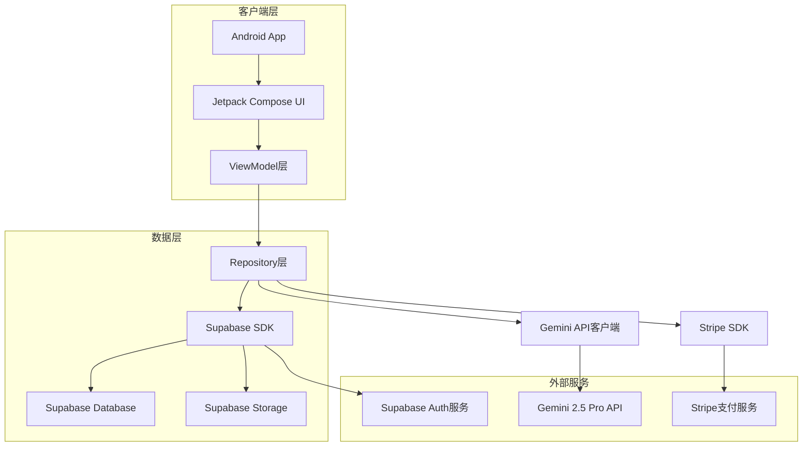
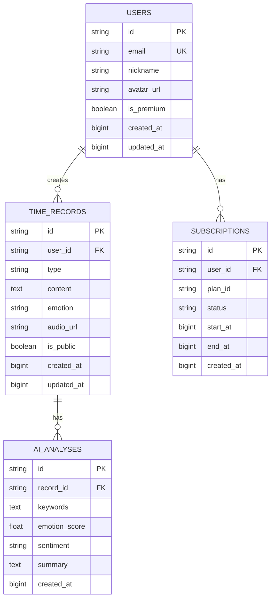

## 1. 架构设计



## 2. 技术描述

- **开发平台**: Android SDK 34+
- **UI框架**: Jetpack Compose + Material Design 3
- **编程语言**: Kotlin
- **架构模式**: MVVM (Model-View-ViewModel)
- **依赖注入**: Hilt
- **数据库**: Room (本地缓存) + Supabase (云端)
- **网络**: Retrofit + OkHttp
- **音频处理**: Android MediaRecorder + ExoPlayer
- **AI处理**: Google Gemini 2.5 Pro原生多模态音频分析
- **AI集成**: Google AI SDK for Gemini
- **支付**: Stripe Android SDK
- **认证**: Supabase Auth
- **状态管理**: Compose State + Flow

## 3. 核心功能模块

### 3.1 用户认证模块
```kotlin
// 用户数据模型
data class User(
    val id: String,
    val email: String,
    val nickname: String,
    val avatarUrl: String?,
    val isPremium: Boolean,
    val createdAt: Long
)

// 认证状态
sealed class AuthState {
    object Loading : AuthState()
    data class Authenticated(val user: User) : AuthState()
    object Unauthenticated : AuthState()
    data class Error(val message: String) : AuthState()
}
```

### 3.2 记录管理模块
```kotlin
// 记录类型
enum class RecordType {
    TEXT, VOICE
}

// 情绪类型
enum class EmotionType {
    HAPPY, TOUCHED, MISSING, SENTIMENTAL, GRATEFUL, HOPEFUL
}

// 记录数据模型
data class TimeRecord(
    val id: String,
    val userId: String,
    val type: RecordType,
    val content: String,
    val emotion: EmotionType,
    val audioUrl: String?,
    val isPublic: Boolean,
    val createdAt: Long,
    val updatedAt: Long
)

// AI解析结果（支持多模态音频分析）
data class AIAnalysis(
    val keywords: List<String>,
    val emotionScore: Float,
    val sentiment: String,
    val summary: String,
    val emotionType: EmotionType? = null  // 直接识别的情绪类型
)
```

### 3.3 会员订阅模块
```kotlin
// 订阅计划
data class SubscriptionPlan(
    val id: String,
    val name: String,
    val price: Float,
    val duration: String, // "month" or "year"
    val features: List<String>
)

// 订阅状态
sealed class SubscriptionStatus {
    object Inactive : SubscriptionStatus()
    data class Active(val expiresAt: Long) : SubscriptionStatus()
    data class Cancelled(val expiresAt: Long) : SubscriptionStatus()
}
```

## 4. API接口定义

### 4.1 用户认证API
```
POST /auth/register
Request: { email: string, password: string, nickname: string }
Response: { user: User, token: string }

POST /auth/login
Request: { email: string, password: string }
Response: { user: User, token: string }

POST /auth/logout
Response: { success: boolean }
```

### 4.2 记录管理API
```
POST /records/create
Request: { type: string, content: string, emotion: string, isPublic: boolean }
Response: { record: TimeRecord }

GET /records/my
Response: { records: List<TimeRecord> }

GET /records/public
Response: { records: List<TimeRecord> }

POST /records/analyze-voice-multimodal
Request: { audioFile: multipart/form-data }
Response: { 
  analysis: AIAnalysis,
  processingTime: number,  // 处理耗时（毫秒）
  audioDuration: number     // 音频时长（秒）
}
```

### 4.3 订阅管理API
```
GET /subscription/plans
Response: { plans: List<SubscriptionPlan> }

POST /subscription/create
Request: { planId: string, paymentMethodId: string }
Response: { clientSecret: string, subscriptionId: string }

GET /subscription/status
Response: { status: SubscriptionStatus }
```

## 5. 数据库设计

### 5.1 数据模型定义


### 5.2 Supabase表结构
```sql
-- 用户表
CREATE TABLE users (
    id UUID PRIMARY KEY DEFAULT gen_random_uuid(),
    email VARCHAR(255) UNIQUE NOT NULL,
    nickname VARCHAR(100) NOT NULL,
    avatar_url TEXT,
    is_premium BOOLEAN DEFAULT FALSE,
    created_at BIGINT NOT NULL,
    updated_at BIGINT NOT NULL
);

-- 时光记录表
CREATE TABLE time_records (
    id UUID PRIMARY KEY DEFAULT gen_random_uuid(),
    user_id UUID REFERENCES users(id) ON DELETE CASCADE,
    type VARCHAR(10) CHECK (type IN ('TEXT', 'VOICE')),
    content TEXT NOT NULL,
    emotion VARCHAR(20) NOT NULL,
    audio_url TEXT,
    is_public BOOLEAN DEFAULT FALSE,
    created_at BIGINT NOT NULL,
    updated_at BIGINT NOT NULL
);

-- AI分析结果表
CREATE TABLE ai_analyses (
    id UUID PRIMARY KEY DEFAULT gen_random_uuid(),
    record_id UUID REFERENCES time_records(id) ON DELETE CASCADE,
    keywords TEXT[],
    emotion_score FLOAT,
    sentiment VARCHAR(20),
    summary TEXT,
    created_at BIGINT NOT NULL
);

-- 订阅记录表
CREATE TABLE subscriptions (
    id UUID PRIMARY KEY DEFAULT gen_random_uuid(),
    user_id UUID REFERENCES users(id) ON DELETE CASCADE,
    plan_id VARCHAR(50) NOT NULL,
    status VARCHAR(20) CHECK (status IN ('active', 'cancelled', 'expired')),
    start_at BIGINT NOT NULL,
    end_at BIGINT NOT NULL,
    created_at BIGINT NOT NULL
);

-- 创建索引
CREATE INDEX idx_time_records_user_id ON time_records(user_id);
CREATE INDEX idx_time_records_created_at ON time_records(created_at DESC);
CREATE INDEX idx_time_records_is_public ON time_records(is_public) WHERE is_public = TRUE;
CREATE INDEX idx_ai_analyses_record_id ON ai_analyses(record_id);
CREATE INDEX idx_subscriptions_user_id ON subscriptions(user_id);

-- 权限设置
GRANT SELECT ON users TO anon;
GRANT ALL PRIVILEGES ON users TO authenticated;
GRANT SELECT ON time_records TO anon;
GRANT ALL PRIVILEGES ON time_records TO authenticated;
GRANT SELECT ON ai_analyses TO anon;
GRANT ALL PRIVILEGES ON ai_analyses TO authenticated;
GRANT SELECT ON subscriptions TO anon;
GRANT ALL PRIVILEGES ON subscriptions TO authenticated;
```

## 6. 关键功能实现

### 6.1 语音录制与多模态处理
```kotlin
@Composable
fun VoiceRecorder(
    onRecordingComplete: (File) -> Unit,
    onAnalysisComplete: (AIAnalysis) -> Unit,
    onRecordingError: (String) -> Unit
) {
    val context = LocalContext.current
    var isRecording by remember { mutableStateOf(false) }
    var recordingTime by remember { mutableStateOf(0L) }
    var isAnalyzing by remember { mutableStateOf(false) }
    
    val recorder = remember { MediaRecorder() }
    val outputFile = remember { File(context.cacheDir, "voice_${System.currentTimeMillis()}.mp3") }
    val geminiService = remember { GeminiAnalysisService() }
    
    // 录制完成后的多模态AI分析
    LaunchedEffect(recordingTime) {
        if (!isRecording && recordingTime > 0) {
            // 录音结束，开始AI分析
            isAnalyzing = true
            try {
                val analysis = geminiService.analyzeVoiceContent(outputFile)
                onAnalysisComplete(analysis)
            } catch (e: Exception) {
                onRecordingError("AI分析失败: ${e.message}")
            } finally {
                isAnalyzing = false
            }
        }
    }
    
    DisposableEffect(Unit) {
        onDispose {
            if (isRecording) {
                recorder.stop()
                recorder.release()
            }
        }
    }
    
    // UI实现：显示录制状态和分析进度...
}
```

### 6.2 AI语音解析（原生多模态处理）
```kotlin
class GeminiAnalysisService {
    private val generativeModel = GenerativeModel(
        modelName = "gemini-2.5-pro",
        apiKey = BuildConfig.GEMINI_API_KEY
    )
    
    suspend fun analyzeVoiceContent(audioFile: File): AIAnalysis {
        val audioContent = audioFile.readBytes()
        
        // 直接使用Gemini原生多模态音频处理能力
        val response = generativeModel.generateContent(
            content {
                // 直接传入音频数据，无需语音转文字
                blob("audio/mp3", audioContent)
                text("""
                    请直接分析这段语音的情感和内容：
                    1. 识别说话者的情绪状态（快乐/感动/思念/感伤/感激/希望）
                    2. 提取核心关键词（3-5个）
                    3. 分析情感强度（0-1之间的数值）
                    4. 生成内容摘要（50字以内）
                    5. 判断整体情感倾向（积极/消极/中性）
                    
                    请以结构化JSON格式返回结果，无需转录文字内容。
                """.trimIndent())
            }
        )
        
        return parseMultimodalAIResponse(response.text)
    }
    
    // 多模态音频分析结果解析
    private fun parseMultimodalAIResponse(responseText: String?): AIAnalysis {
        return try {
            val json = JSONObject(responseText ?: "{}")
            AIAnalysis(
                keywords = json.optJSONArray("keywords")?.let { 
                    List(it.length()) { i -> it.getString(i) }
                } ?: emptyList(),
                emotionScore = json.optDouble("emotion_score", 0.5).toFloat(),
                sentiment = json.optString("sentiment", "neutral"),
                summary = json.optString("summary", ""),
                emotionType = EmotionType.valueOf(
                    json.optString("emotion_type", "HOPEFUL").uppercase()
                )
            )
        } catch (e: Exception) {
            // 返回默认分析结果
            AIAnalysis(
                keywords = listOf("回忆", "情感"),
                emotionScore = 0.5f,
                sentiment = "neutral",
                summary = "语音情感记录",
                emotionType = EmotionType.HOPEFUL
            )
        }
    }
}
```

### 6.3 Stripe支付集成
```kotlin
class StripePaymentService {
    fun createSubscription(
        planId: String,
        paymentMethodId: String,
        onSuccess: (String) -> Unit,
        onError: (String) -> Unit
    ) {
        // 调用后端API创建订阅
        viewModelScope.launch {
            try {
                val response = apiService.createSubscription(planId, paymentMethodId)
                onSuccess(response.clientSecret)
            } catch (e: Exception) {
                onError(e.message ?: "支付失败")
            }
        }
    }
}
```

## 7. 性能优化

### 7.1 本地缓存策略
- 使用Room数据库存储用户最近的50条记录
- 图片和音频文件采用LRU缓存机制
- 网络请求结果缓存5分钟

### 7.2 音频处理优化
- **原生多模态处理**: 直接音频文件上传，无需语音转文字
- **实时压缩**: 录音时实时压缩为MP3格式，减少网络传输
- **质量检测**: 上传前进行音频质量检测和压缩
- **分片上传**: 大文件采用分片上传，提高成功率
- **并行处理**: 音频上传与AI分析并行进行，优化用户体验

### 7.3 UI性能优化
- 使用Compose的remember和derivedStateOf优化重组
- 图片加载使用Coil库，支持内存缓存
- 列表采用lazyColumn实现虚拟化滚动